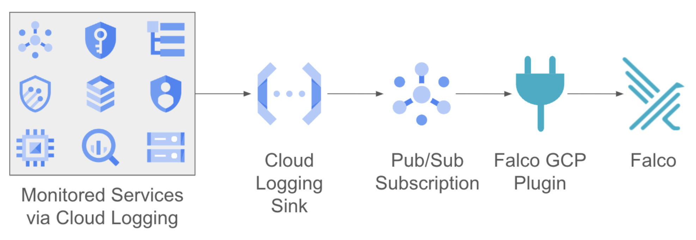

### GCP Audit Logs Plugin Overview

As the name suggests, the GCP Audit Logs plugin ingests GCP Audit Logs for several key GCP services. 

An optimized GCP logging sink is used to send the most critical events from the monitored services to a user-defined Pub/Sub subscription. 



The filtering process is based on a set of custom Falco rules authored with the [Mitre Att&ck framework](https://www.mitre.org/focus-areas/cybersecurity/mitre-attack) in mind. When an action, such as deleting a VM, triggers one of the rules, Falco sends out an alert. 

### GCP Audit Logs walkthrough

In this section, you will learn how to install and use the GCP Audit Logs plugin. You’ll first configure the necessary GCP services. This includes setting up a Pub/Sub topic and subscription and creating a GCP Logging service sink. Then, you will build the plugin. Next, you’ll install Falco and configure it to use the plugin. Finally, you’ll test everything to ensure it’s all working correctly. 

#### Prerequisites

To follow along with this tutorial, you will need a GCP project and an account with appropriate permissions, including the ability to:


* Create and manage compute instances
* Create and manage pub/sub topics
* Access GCP audit logs and create custom GCP Logging sinks

You will also need to have the gcloud command line tool installed on your local machine or use Cloud Shell (which already has gcloud installed). 

Make sure you know the project ID of your GCP project. 

Finally, to build the plugin, you will need to have both Git and Go 1.17 or greater. If you use Cloud Shell, both tools are already installed for you. 


#### Step 1: Configure the GCP services

In this section, you’ll configure the necessary backend GCP services. 

**NOTE**: This walkthrough creates resources that could incur charges against your GCP bill. The easiest way to reduce charges is to use a project that can be deleted when you are finished. Alternatively, you will need to delete the resources you created manually upon creation. There are instructions on how to do this at the end of the walkthrough. 

To begin make sure you’re authenticated to your GCP account in gcloud and you’ve selected the appropriate project.


```shell
gcloud auth login 
gcloud config set project [project id]
```


It is helpful later on to have your GCP project ID configured in an environment variable.

```shell
export PROJECT_ID="[project id]"
```

The next step is to create a Pub/Sub topic to receive the output from the GCP Audit logs. 

```shell
gcloud pubsub topics create falco-plugin-topic`
```

The plugin uses a Pub/Sub subscription to receive events, so create that now.

```shell 
gcloud pubsub subscriptions create falco-plugin-sub --topic=falco-plugin-topic
```

Next, create a GCP Logging sink to filter events and send them over to the Pub/Sub topic you just created. In this example, you use Falco’s recommended sink query, but you can adjust the query as you see fit based on your organization’s needs. 

**NOTE**: You will need to manually add your project ID in the first line of the `--log-filter` parameter (all the quotations make variable interpolation difficult).


```
gcloud logging sinks create falco-plugin-sink pubsub.googleapis.com/projects/$PROJECT_ID/topics/falco-plugin-topic --log-filter='"projects/[PROJECT ID]/logs/cloudaudit.googleapis.com%2Factivity" AND
(protoPayload.serviceName="cloudsql.googleapis.com" OR
protoPayload.serviceName="logging.googleapis.com" OR
protoPayload.serviceName="iam.googleapis.com" OR
(protoPayload.serviceName="compute.googleapis.com" AND NOT
protoPayload.authenticationInfo.principalEmail=~"^service-") OR
protoPayload.serviceName="pubsub.googleapis.com" OR
protoPayload.serviceName="cloudkms.googleapis.com" OR
protoPayload.serviceName="cloudfunctions.googleapis.com" OR
protoPayload.serviceName="storage.googleapis.com" OR
protoPayload.serviceName="cloudresourcemanager.googleapis.com" OR
protoPayload.serviceName="bigquery.googleapis.com")'
```

You should see a message that the sink was successfully created, but notice the guidance near the end regarding service account permissions (your service account email will be different than below).

Please remember to grant `serviceAccount:service-abc123@gcp-sa-logging.iam.gserviceaccount.com` the Pub/Sub Publisher role on the topic.

We need to allow the logging service permission to write to Pub/Sub. Start by creating an environment variable for the service account email.

```
SA=[service account email from the last command's output] 
```

For example:

```shell
SA=serviceAccount:service-abc123@gcp-sa-logging.iam.gserviceaccount.com
```

Next, bind the Pub/Sub Publisher role to the to the service account.

```shell
gcloud projects add-iam-policy-binding $PROJECT_ID \
--member=$SA \
--role=roles/pubsub.publisher
```


At this point, any events that match the audit logs filter should be passed onto the Pub/Sub subscription. You can test that by creating and deleting a new Pub/Sub topic and then pulling messages from the subscription looking for any messages with “pubsub” in the output.

```shell
gcloud pubsub topics create test && \
gcloud pubsub topics delete test && \
gcloud pubsub subscriptions pull falco-plugin-sub | grep pubsub
```

You should see logging output for the Pub/Sub commands you just issued. If you do not, verify that you have correctly created the logging sink (double check you specified your project ID) and that you have bound the Pub/Sub publisher role to the logging service account. 

#### Step 2: Build the plugin

In this step, you will build the GCP Audit Logs plugin, and copy it up to the VM that will be used to run Falco. 

We’ll start by creating the Falco VM.

```shell
gcloud compute instances create falco \
--project=$PROJECT_ID \
--zone=us-central1-a \
--machine-type=e2-medium  --create-disk=auto-delete=yes,boot=yes,device-name=falco,image=projects/ubuntu-os-cloud/global/images/ubuntu-2004-focal-v20231213,mode=rw,size=10,type=projects/$PROJECT_ID/zones/us-central1-a/diskTypes/pd-balanced
```

While the VM is being created build the plugin. First, clone the plugins repository, then change to the appropriate directory, and finally compile the plugin shared library.

```shell
git clone https://github.com/falcosecurity/plugins.git
cd plugins/plugins/gcpaudit
make
```

This will create the plugin file (`libgcpaudit.so`), which needs to be copied to the Falco VM. 

```shell
gcloud compute scp libgcpaudit.so falco:~/ --zone=us-central1-a
```

You also need to copy the Falco rules file for the plugin to the VM. 

```shell
cd rules
gcloud compute scp gcp_auditlog_rules.yaml falco:/ --zone=us-central1-a
```

Now shell into the newly created VM.

**Note**: You may need to follow the prompts to create a new SSH key. 

```shell
gcloud compute ssh falco --zone=us-central1-a
```

### Step 4: Install Falco and Configure the Plugin

Now you will install Falco, move the plugin and plugin rules files into the appropriate directory, and edit the Falco configuration file to enable the plugin. 

Start by trusting the Falcosecurity key.

```shell
curl -fsSL https://falco.org/repo/falcosecurity-packages.asc | \
sudo gpg --dearmor -o /usr/share/keyrings/falco-archive-keyring.gpg
```
Configure the Apt repository.

```shell
echo "deb [signed-by=/usr/share/keyrings/falco-archive-keyring.gpg] https://download.falco.org/packages/deb stable main" | \
sudo tee -a /etc/apt/sources.list.d/falcosecurity.list
```
Update the packages list. 

```shell
sudo apt-get update -y
```

The Falco installer needs to have the `dialog` package installed, so install that now. 

```shell
sudo apt install -y dialog
```

Install the Falco binary.

```shell
sudo apt-get install -y falco
```

You will be prompted to choose a Falco driver: choose **_Modern eBPF_**. 

When asked if you want to automatically update the rulesets choose **_No_**. 

**Note**: In production, you might choose to do the automatic updates, but for this tutorial, it’s not necessary.  

Check to ensure Falco is up and running. 

```shell
sudo systemctl status falco-modern-bpf
```

You should see something similar to the following. 

The output should indicate that Falco is “active (running)”.

Press **_Q_** to continue. 

Verify that Falco is running appropriately. 

```shell
sudo cat /etc/shadow
cat /var/log/syslog | grep Warning
```

You should see something similar to the following output. 

```
Jan  3 19:39:42 falco falco: 19:39:42.522581168: Warning Sensitive file opened for reading by non-trusted program (file=/etc/shadow gparent=bash ggparent=sshd gggparent=sshd evt_type=openat user=root user_uid=0 user_loginuid=1001 process=cat proc_exepath=/usr/bin/cat parent=sudo command=cat /etc/shadow terminal=34816 exe_flags=O_RDONLY container_id=host container_name=host)
```

Copy the plugin and rules files into the appropriate directories. 

```shell
sudo cp libgcpaudit.so /usr/share/falco/plugins
sudo cp gcp_auditlog_rules.yaml /etc/falco
```

Next, you need to edit the Falco configuration file. You’re going to be editing three sections. The first will tell Falco to load the plugin’s rules. The second will instruct Falco to load the plugin (along with the JSON plugin which is also required), and the third will provide configuration information for Falco. 

With whatever text editor you prefer open `/etc/falco/falco.yaml`. 

**Note**: You will need admin privileges to edit the file, so use `sudo` if necessary

Find the `rules_file:` section and add an entry for `/etc/falco/gcp_auditlog_rules.yaml`.

```shell
rules_file:
    - /etc/falco/falco_rules.yaml
    - /etc/falco/falco_rules.local.yaml
    - /etc/falco/rules.d
    - /etc/falco/gcp_auditlog_rules.yaml
```

Find the `load_plugins:` section, and add entries for `json` and `gcpaudit`. 

```shell
load_plugins: [json, gcpaudit]
```

Finally find the `plugins:` section and append an entry for the GCP Audit Logs plugin. 

**Note**: Make sure to specify your project ID in the last line

```shell
plugins:
    - name: json
    library_path: libjson.so
    - name: gcpaudit
    library_path: libgcpaudit.so
    open_params: "falco-plugin-sub"
    init_config:
        project_id: "[PROJECT ID]"
```

Falco is configured to monitor changes to its configuration files, so there is no need to restart the service. 

#### Step 3: Test the Plugin

With everything configured, the last step is to test the GCP Audit Logs plugin.

If you read the [plugin rules file](https://github.com/falcosecurity/plugins/blob/main/plugins/gcpaudit/rules/gcp_auditlog_rules.yaml), you will see that there are dozens of different rules that you could test, but to keep it simple we’ll repeat the same test we did earlier and create and delete a Pub/Sub topic. 

Since the VM you created to run Falco does not have `gcloud` installed, the easiest way to do this section is to create a second shell instance either back on your local machine or in Cloud Shell - wherever you originally ran the gcloud commands from.

In the newly instantiated shell, create and delete a Pub/Sub topic.

```shell
gcloud pubsub topics create test && \
gcloud pubsub topics delete test
```

Move back into the SSH session for the Falco VM and check the Falco logs to see if they show entries for the Pub/Sub activity. 

```shell
cat /var/log/syslog | grep Pub/Sub   
```

You should see something similar to the following output:

```
Jan  3 19:48:00 falco falco: 19:48:00.117403000: Notice project=project-id A GCP Pub/Sub topic has been deleted by user=user@company.com userIP=10.0.0.1
userAgent=google-cloud-sdk gcloud/457.0.0 command/gcloud.pubsub.topics.delete invocation-id/d8cf1344e1be4f52a951285c1c158b61 environment/devshell environment-version/None client-os/LINUX client-os-ver/6.1.58 client-pltf-arch/x86_64 interactive/True from-script/False python/3.11.6 term/screen (Linux 6.1.58+),gzip(gfe)  authorizationInfo=<NA>  rawRequest=<NA>
```

You might have noticed that there is only a notification for the deletion of the topic. Why would that be?  Because there is no Falco rule defined for the creation of a new topic. If you wanted to be notified on topic creation, you could very easily add a rule to do that. 

If you’re interested in testing out other rules, go ahead and examine the rules file to see what other scenarios generate alerts (one that I, and many others, could have used for sure is the one that alerts when a storage bucket is made public). Once you have found a rule you want to test, simply perform that action in GCP and then examine the Falco outputs. 

### Cleanup

If you want to tear down the services you created during the walkthrough you have two choices.

1. Delete the entire project.

```shell
gcloud projects delete $PROJECT_ID
```

2. Delete just the resources that were created during the walkthrough. From the machine where you ran the gcloud commands originally: 

```shell
gcloud compute instances delete falco --zone=us-central1-a
gcloud pubsub subscriptions delete falco-plugin-sub
gcloud pubsub topics delete falco-plugin-topic
gcloud logging sinks delete falco-plugin-sink
```

You might also want to delete the GitHub repo you cloned onto your local machine or Cloud Shell environment. 
