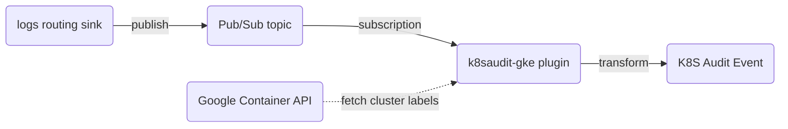

# Kubernetes Audit Events Plugin for GKE

## Introduction

[Audit logs](https://cloud.google.com/kubernetes-engine/docs/how-to/audit-logging) created by Google Kubernetes Engine (GKE) are part of Google's [Cloud Audit Logs](https://cloud.google.com/logging/docs/audit), which in turn are part of Google's [Cloud Logging](https://cloud.google.com/logging).

This means we have no control over the [audit policy](https://kubernetes.io/docs/tasks/debug/debug-cluster/audit/#audit-policy) and, more importantly, we have no access to the original [audit event](https://kubernetes.io/docs/reference/config-api/apiserver-audit.v1/#audit-k8s-io-v1-Event) emitted by the Kubernetes API server.

This plugin tries to reconstruct an audit event object as defined in the `audit.k8s.io` API group from the available information in the Google [`LogEntry`](https://cloud.google.com/logging/docs/reference/v2/rest/v2/LogEntry). Unfortunately this might mean that certain information is simply unavailable to Falco.

## How it works

GKE Admin Activity audit logs and GKE Data Access audit logs can be send to a Pub/Sub topic using a logs routing sink. The Falco `k8saudit-gke` plugin uses a subscription on this Pub/Sub topic to pull the audit log entries.

Optionally, the `k8saudit-gke` plugin can use the Google Container API to fetch cluster resource metadata labels. These cluster labels are appended to the resource labels of the log entry.

Finally, the Google audit log entries are converted to a Kubernetes audit event object and handed off to the Falco rule pipeline. This means the field extraction methods and rules of the [`k8saudit`](https://github.com/falcosecurity/plugins/tree/master/plugins/k8saudit) can be used.
Note: As the Kubernetes audit event is reconstructed from a Google audit logs entry some Falco rules might not work as expected due to missing information.



## Usage

### Configuration

Here's an example of configuration of `falco.yaml`:

```yaml
plugins:
- init_config:
    project_id: "your-gcp-project-id"
    maxEventSize: 8000000
    set_cluster_labels: true
  library_path: libk8saudit-gke.so
  name: k8saudit-gke
  open_params: "your-gcp-subscription-id"

load_plugins: [k8saudit-gke, json]
```

**Initialization Config**:

- `project_id`: The Google project ID containing your PubSub topic/subscription.
- `credentials_file`: If non-empty overrides the default GCP credentials file (default: empty)
- `num_goroutines`: The number of goroutines that each datastructure along the PubSub receive path will spawn (default: 10)
- `maxout_stand_messages`: The maximum number of unprocessed PubSub messages (default: 1000)
- `fetch_cluster_metadata`: If true then use the Google Container API to fetch cluster metadata labels (default: false)
- `cache_expiration`: Cluster metadata cache expiration duration in minutes (default: 10)
- `use_async`: If true then async extraction optimization is enabled (default: true)
- `max_event_size`: Maximum size of single audit event (default: 262144)

Note: as described in issue [#2475](https://github.com/falcosecurity/falco/issues/2475) it might be better to turn off the async extraction optimization.

**Open Parameters**:

A string which contains the subscriber name for your Google PubSub topic (required).

### Setting up a Google PubSub topic and subscription

As Google supports publishing messages to a PubSub topic in a different Google project, the following setup with a single PubSub subscription is possible.

PubSub setup:
- create a PubSub topic (e.g. `falco-gke-audit-topic`) in a separate Google project from the projects containing your GKE clusters
- create a subscription (e.g. `falco-gke-audit-sub`) to the PubSub topic created above
- create a service account and bind the iam role `roles/pubsub.subscriber`
- provide the credentials file of this service account to the `k8saudit-gke` plugin

Log Router Sinks setup (for each Google project containing GKE clusters):
- create a logs routing sink (e.g. `falco-gke-audit-sink`) with the following options:
  - destination: `pubsub.googleapis.com/<your PubSub topic>` (e.g. `pubsub.googleapis.com/<my-google-pubsub-project-id>/topics/falco-gke-audit-topic`)
  - filter: `logName=~"projects/.+/logs/cloudaudit.googleapis.com%2F(activity|data_access)" AND protoPayload.serviceName="k8s.io"`
  - exclusion filters (optional): e.g. `protoPayload.methodName="io.k8s.coordination.v1.leases.update"` (exclusion filters reduce the number of log entries send to Falco)
- bind the iam role `roles/pubsub.publisher` to the log sink writer identity

### Cluster resource labels and Google Container API permissions

To fetch cluster metadata from the Google Container API (enabled with the `fetch_cluster_metadata` flag), the serviceaccount used by the `k8saudit-gke` plugin requires the iam rolebinding `roles/container.clusterViewer` for each Google project sending GKE auditlogs to the PubSub topic.

The cluster resource labels are internally added to the `labels` field of the Google `LogEntry.resource` object. These labels in turn are added to the `annotations` field of the reconstructed Kubernetes `audit.k8s.io/v1/Event` object.

For example the default 'resource' labels of a `LogEntry` are available in a Falco rule as follows, but the same applies to your own cluster metadata labels:
- `%jevt.value[/annotations/cluster_name]`
- `%jevt.value[/annotations/location]`
- `%jevt.value[/annotations/project_id]`

## Running locally

To build and run the `k8saudit-gke` plugin locally on MacOS, the following steps can be followed:

- d/l json plugin with falcoctl:
```
docker run -ti --rm -v "${PWD}"/hack:/plugins falcosecurity/falcoctl artifact install json --plugins-dir=/plugins
```

- build k8saudit-gke plugin from its src dir:
```
docker run -ti --rm -v "${PWD}"/:/go/src --workdir=/go/src golang:1.21 make
```

- run falco container from k8saudit-gke plugin src dir:
```
docker run -ti --rm -v "${PWD}"/hack/falco.yaml:/etc/falco/falco.yaml:ro -v "${PWD}"/hack/rules.yaml:/etc/falco/rules.d/rules.yaml:ro -v "${HOME}"/.config/gcloud/application_default_credentials.json:/root/.config/gcloud/application_default_credentials.json:ro -v "${PWD}"/hack/libjson.so://usr/share/falco/plugins/libjson.so:ro -v "${PWD}"/libk8saudit-gke.so:/usr/share/falco/plugins/libk8saudit-gke.so:ro -v "${PWD}"/test:/test/:ro falcosecurity/falco-no-driver:0.37.1 falco --disable-source syscall
```

See `hack/falco.yaml` for `open_params`. To test specific Google auditlog events the `file://` option can be used to point to local json files, otherwise point to a Google Pub/Sub subscription:
```
  # open_params: "file://test/pods_create.json"
  open_params: "falco-gke-audit-sub"
```

## References

- https://cloud.google.com/logging/docs/reference/v2/rest/v2/LogEntry
- https://cloud.google.com/logging/docs/reference/audit/auditlog/rest/Shared.Types/AuditLog
