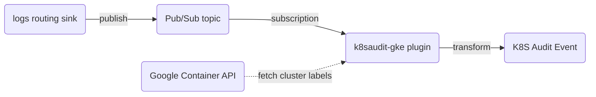

# Kubernetes Audit Events Plugin for GKE

## Introduction

[Audit logs](https://cloud.google.com/kubernetes-engine/docs/how-to/audit-logging) created by Google Kubernetes Engine (GKE) are part of Google's [Cloud Audit Logs](https://cloud.google.com/logging/docs/audit), which in turn are part of Google's [Cloud Logging](https://cloud.google.com/logging).

This means we have no control over the [audit policy](https://kubernetes.io/docs/tasks/debug/debug-cluster/audit/#audit-policy) and, more importantly, we have no access to the original [audit event](https://kubernetes.io/docs/reference/config-api/apiserver-audit.v1/#audit-k8s-io-v1-Event) emitted by the Kubernetes API server.

This plugin tries to reconstruct an audit event object as defined in the `audit.k8s.io` API group from the available information in the Google [`LogEntry`](https://cloud.google.com/logging/docs/reference/v2/rest/v2/LogEntry). Unfortunately this might mean that certain information is simply unavailable to Falco.

## How it works

GKE Admin Activity audit logs and GKE Data Access audit logs can be send to a Pub/Sub topic using a logs routing sink. The Falco `k8saudit-gke` plugin uses a subscription on this Pub/Sub topic to pull the audit log entries.

Optionally, the `k8saudit-gke` plugin can use the Google Container API to fetch cluster resource metadata labels. These cluster labels are appended to the resource labels of the log entry.

Finally, the Google audit log entries are converted to a Kubernetes audit event object and handed off to the Falco rule pipeline. This means the field extraction methods and rules of the [`k8saudit`](https://github.com/falcosecurity/plugins/tree/main/plugins/k8saudit) can be used.
> [!WARNING] 
> As the Kubernetes audit event is reconstructed from a Google audit logs entry some Falco rules might not work as expected due to missing information.



### Supported Fields

Here is the current set of supported fields (from `k8saudit` plugin's extractor):

<!-- README-PLUGIN-FIELDS -->
|                        NAME                        |      TYPE       |      ARG      |                                                                                                 DESCRIPTION                                                                                                  |
|----------------------------------------------------|-----------------|---------------|--------------------------------------------------------------------------------------------------------------------------------------------------------------------------------------------------------------|
| `ka.auditid`                                       | `string`        | None          | The unique id of the audit event                                                                                                                                                                             |
| `ka.stage`                                         | `string`        | None          | Stage of the request (e.g. RequestReceived, ResponseComplete, etc.)                                                                                                                                          |
| `ka.auth.decision`                                 | `string`        | None          | The authorization decision                                                                                                                                                                                   |
| `ka.auth.reason`                                   | `string`        | None          | The authorization reason                                                                                                                                                                                     |
| `ka.auth.openshift.decision`                       | `string`        | None          | The authentication decision of the openshfit apiserver extention. Only available on openshift clusters                                                                                                       |
| `ka.validations.admission.policy.failure`          | `string`        | None          | The validation failure reason from a Validation Admission Policy                                                                                                                                             |
| `ka.security.pod.violations`                       | `string`        | None          | The violation reason for pod security policy                                                                                                                                                                 |
| `ka.auth.openshift.username`                       | `string`        | None          | The user name performing the openshift authentication operation. Only available on openshift clusters                                                                                                        |
| `ka.user.name`                                     | `string`        | None          | The user name performing the request                                                                                                                                                                         |
| `ka.user.groups`                                   | `string (list)` | None          | The groups to which the user belongs                                                                                                                                                                         |
| `ka.impuser.name`                                  | `string`        | None          | The impersonated user name                                                                                                                                                                                   |
| `ka.verb`                                          | `string`        | None          | The action being performed                                                                                                                                                                                   |
| `ka.uri`                                           | `string`        | None          | The request URI as sent from client to server                                                                                                                                                                |
| `ka.uri.param`                                     | `string`        | Key, Required | The value of a given query parameter in the uri (e.g. when uri=/foo?key=val, ka.uri.param[key] is val).                                                                                                      |
| `ka.target.name`                                   | `string`        | None          | The target object name                                                                                                                                                                                       |
| `ka.target.namespace`                              | `string`        | None          | The target object namespace                                                                                                                                                                                  |
| `ka.target.resource`                               | `string`        | None          | The target object resource                                                                                                                                                                                   |
| `ka.target.subresource`                            | `string`        | None          | The target object subresource                                                                                                                                                                                |
| `ka.target.pod.name`                               | `string`        | None          | The target pod name                                                                                                                                                                                          |
| `ka.req.binding.subjects`                          | `string (list)` | None          | When the request object refers to a cluster role binding, the subject (e.g. account/users) being linked by the binding                                                                                       |
| `ka.req.binding.subjects.user_names`               | `string (list)` | None          | When the request object refers to a cluster role binding, the subject user names being linked by the binding                                                                                                 |
| `ka.req.binding.subjects.serviceaccount_names`     | `string (list)` | None          | When the request object refers to a cluster role binding, the subject service account names being linked by the binding                                                                                      |
| `ka.req.binding.subjects.serviceaccount_ns_names`  | `string (list)` | None          | When the request object refers to a cluster role binding, the subject serviceaccount namespaced names being linked by the binding, e.g. a list containing: mynamespace:myserviceaccount                      |
| `ka.req.binding.subjects.group_names`              | `string (list)` | None          | When the request object refers to a cluster role binding, the subject group names being linked by the binding                                                                                                |
| `ka.req.binding.role`                              | `string`        | None          | When the request object refers to a cluster role binding, the role being linked by the binding                                                                                                               |
| `ka.req.binding.subject.has_name`                  | `string`        | Key, Required | Deprecated, always returns "N/A". Only provided for backwards compatibility                                                                                                                                  |
| `ka.req.configmap.name`                            | `string`        | None          | If the request object refers to a configmap, the configmap name                                                                                                                                              |
| `ka.req.configmap.obj`                             | `string`        | None          | If the request object refers to a configmap, the entire configmap object                                                                                                                                     |
| `ka.req.pod.containers.args`                       | `string (list)` | Index         | When the request object refers to a pod, the container's args.                                                                                                                                               |
| `ka.req.pod.containers.command`                    | `string (list)` | Index         | When the request object refers to a pod, the container's command.                                                                                                                                            |
| `ka.req.pod.containers.name`                       | `string (list)` | Index         | When the request object refers to a pod, the container's names.                                                                                                                                              |
| `ka.req.pod.containers.image`                      | `string (list)` | Index         | When the request object refers to a pod, the container's images.                                                                                                                                             |
| `ka.req.container.image`                           | `string`        | None          | Deprecated by ka.req.pod.containers.image. Returns the image of the first container only                                                                                                                     |
| `ka.req.pod.containers.image.repository`           | `string (list)` | Index         | The same as req.container.image, but only the repository part (e.g. falcosecurity/falco).                                                                                                                    |
| `ka.req.container.image.repository`                | `string`        | None          | Deprecated by ka.req.pod.containers.image.repository. Returns the repository of the first container only                                                                                                     |
| `ka.req.pod.host_ipc`                              | `string`        | None          | When the request object refers to a pod, the value of the hostIPC flag.                                                                                                                                      |
| `ka.req.pod.host_network`                          | `string`        | None          | When the request object refers to a pod, the value of the hostNetwork flag.                                                                                                                                  |
| `ka.req.container.host_network`                    | `string`        | None          | Deprecated alias for ka.req.pod.host_network                                                                                                                                                                 |
| `ka.req.pod.host_pid`                              | `string`        | None          | When the request object refers to a pod, the value of the hostPID flag.                                                                                                                                      |
| `ka.req.pod.containers.host_port`                  | `string (list)` | Index         | When the request object refers to a pod, all container's hostPort values.                                                                                                                                    |
| `ka.req.pod.containers.privileged`                 | `string (list)` | Index         | When the request object refers to a pod, the value of the privileged flag for all containers.                                                                                                                |
| `ka.req.container.privileged`                      | `string`        | None          | Deprecated by ka.req.pod.containers.privileged. Returns true if any container has privileged=true                                                                                                            |
| `ka.req.pod.containers.allow_privilege_escalation` | `string (list)` | Index         | When the request object refers to a pod, the value of the allowPrivilegeEscalation flag for all containers                                                                                                   |
| `ka.req.pod.containers.read_only_fs`               | `string (list)` | Index         | When the request object refers to a pod, the value of the readOnlyRootFilesystem flag for all containers                                                                                                     |
| `ka.req.pod.run_as_user`                           | `string`        | None          | When the request object refers to a pod, the runAsUser uid specified in the security context for the pod. See ....containers.run_as_user for the runAsUser for individual containers                         |
| `ka.req.pod.containers.run_as_user`                | `string (list)` | Index         | When the request object refers to a pod, the runAsUser uid for all containers                                                                                                                                |
| `ka.req.pod.containers.eff_run_as_user`            | `string (list)` | Index         | When the request object refers to a pod, the initial uid that will be used for all containers. This combines information from both the pod and container security contexts and uses 0 if no uid is specified |
| `ka.req.pod.run_as_group`                          | `string`        | None          | When the request object refers to a pod, the runAsGroup gid specified in the security context for the pod. See ....containers.run_as_group for the runAsGroup for individual containers                      |
| `ka.req.pod.containers.run_as_group`               | `string (list)` | Index         | When the request object refers to a pod, the runAsGroup gid for all containers                                                                                                                               |
| `ka.req.pod.containers.eff_run_as_group`           | `string (list)` | Index         | When the request object refers to a pod, the initial gid that will be used for all containers. This combines information from both the pod and container security contexts and uses 0 if no gid is specified |
| `ka.req.pod.containers.proc_mount`                 | `string (list)` | Index         | When the request object refers to a pod, the procMount types for all containers                                                                                                                              |
| `ka.req.role.rules`                                | `string (list)` | None          | When the request object refers to a role/cluster role, the rules associated with the role                                                                                                                    |
| `ka.req.role.rules.apiGroups`                      | `string (list)` | Index         | When the request object refers to a role/cluster role, the api groups associated with the role's rules                                                                                                       |
| `ka.req.role.rules.nonResourceURLs`                | `string (list)` | Index         | When the request object refers to a role/cluster role, the non resource urls associated with the role's rules                                                                                                |
| `ka.req.role.rules.verbs`                          | `string (list)` | Index         | When the request object refers to a role/cluster role, the verbs associated with the role's rules                                                                                                            |
| `ka.req.role.rules.resources`                      | `string (list)` | Index         | When the request object refers to a role/cluster role, the resources associated with the role's rules                                                                                                        |
| `ka.req.pod.fs_group`                              | `string`        | None          | When the request object refers to a pod, the fsGroup gid specified by the security context.                                                                                                                  |
| `ka.req.pod.supplemental_groups`                   | `string (list)` | None          | When the request object refers to a pod, the supplementalGroup gids specified by the security context.                                                                                                       |
| `ka.req.pod.containers.add_capabilities`           | `string (list)` | Index         | When the request object refers to a pod, all capabilities to add when running the container.                                                                                                                 |
| `ka.req.service.type`                              | `string`        | None          | When the request object refers to a service, the service type                                                                                                                                                |
| `ka.req.service.ports`                             | `string (list)` | Index         | When the request object refers to a service, the service's ports                                                                                                                                             |
| `ka.req.pod.volumes.hostpath`                      | `string (list)` | Index         | When the request object refers to a pod, all hostPath paths specified for all volumes                                                                                                                        |
| `ka.req.volume.hostpath`                           | `string`        | Key, Required | Deprecated by ka.req.pod.volumes.hostpath. Return true if the provided (host) path prefix is used by any volume                                                                                              |
| `ka.req.pod.volumes.flexvolume_driver`             | `string (list)` | Index         | When the request object refers to a pod, all flexvolume drivers specified for all volumes                                                                                                                    |
| `ka.req.pod.volumes.volume_type`                   | `string (list)` | Index         | When the request object refers to a pod, all volume types for all volumes                                                                                                                                    |
| `ka.resp.name`                                     | `string`        | None          | The response object name                                                                                                                                                                                     |
| `ka.response.code`                                 | `string`        | None          | The response code                                                                                                                                                                                            |
| `ka.response.reason`                               | `string`        | None          | The response reason (usually present only for failures)                                                                                                                                                      |
| `ka.useragent`                                     | `string`        | None          | The useragent of the client who made the request to the apiserver                                                                                                                                            |
| `ka.sourceips`                                     | `string (list)` | Index         | The IP addresses of the client who made the request to the apiserver                                                                                                                                         |
| `ka.cluster.name`                                  | `string`        | None          | The name of the k8s cluster                                                                                                                                                                                  |
<!-- /README-PLUGIN-FIELDS -->

## Usage

### Configuration

Here's an example of configuration of `falco.yaml`:

```yaml
plugins:
- init_config:
    project_id: "your-gcp-project-id"
    max_event_size: 8000000
    set_cluster_labels: true
  library_path: libk8saudit-gke.so
  name: k8saudit-gke
  open_params: "your-gcp-subscription-id"

load_plugins: [k8saudit-gke, json]
```

**Initialization Config**:

- `project_id`: The Google project ID containing your Pub/Sub topic/subscription.
- `credentials_file`: If non-empty overrides the default GCP credentials file (default: empty)
- `num_goroutines`: The number of goroutines that each datastructure along the Pub/Sub receive path will spawn (default: 10)
- `maxout_stand_messages`: The maximum number of unprocessed Pub/Sub messages (default: 1000)
- `fetch_cluster_metadata`: If true then use the Google Container API to fetch cluster metadata labels (default: false)
- `cache_expiration`: Cluster metadata cache expiration duration in minutes (default: 10)
- `use_async`: If true then async extraction optimization is enabled (default: true)
- `max_event_size`: Maximum size of single audit event (default: 262144)

Note: as described in issue [#2475](https://github.com/falcosecurity/falco/issues/2475) it might be better to turn off the async extraction optimization.

**Open Parameters**:

A string which contains the subscriber name for your Google Pub/Sub topic (required).

### Setting up a Google Pub/Sub topic and subscription

A Pub/Sub topic and subscription can be created in the same Google project as your GKE cluster(s). If you run GKE clusters in different Google projects, this would mean deploying multiple Falco `k8saudit-gke` plugin instances, as the Falco `k8saudit-gke` plugin only supports a single subscription.

Fortunately, Google supports publishing messages to a Pub/Sub topic in a different Google project. Hence it is possible to create a single Pub/Sub topic and subscription with log sinks from different projects routing log entries to it.

In case a single Falco `k8saudit-gke` plugin instance is not able to handle your audit log volume, you can use the following Pub/Sub publish and subscribe [patterns](https://cloud.google.com/pubsub/docs/pubsub-basics#choose_a_publish_and_subscribe_pattern) (or a combination of them):
1) create multiple topics (e.g. one per Google project or GKE cluster) and corresponding subscriptions
2) create a single topic and multiple subscriptions with different [message filters](https://cloud.google.com/pubsub/docs/subscription-message-filter)
3) use multiple Falco `k8saudit-gke` plugin instances with a single subscription by enabling [exactly-once delivery](https://cloud.google.com/pubsub/docs/exactly-once-delivery). Only supported within a single cloud region.

Pub/Sub setup:
- create a Pub/Sub topic (e.g. `falco-gke-audit-topic`), this can be in the same or in a different Google project as your GKE cluster(s)
- create a subscription (e.g. `falco-gke-audit-sub`) to the Pub/Sub topic created above
- create a service account and bind the iam role `roles/pubsub.subscriber`
- provide the credentials file of this service account to the `k8saudit-gke` plugin

Log Router Sinks setup (for each Google project containing GKE clusters):
- create a logs routing sink (e.g. `falco-gke-audit-sink`) with the following options:
  - destination: `pubsub.googleapis.com/<your Pub/Sub topic>` (e.g. `pubsub.googleapis.com/<my-google-pubsub-project-id>/topics/falco-gke-audit-topic`)
  - filter: `logName=~"projects/.+/logs/cloudaudit.googleapis.com%2F(activity|data_access)" AND protoPayload.serviceName="k8s.io"`
  - exclusion filters (optional): e.g. `protoPayload.methodName="io.k8s.coordination.v1.leases.update"` (exclusion filters reduce the number of log entries send to Falco)
- bind the iam role `roles/pubsub.publisher` to the log sink writer identity

See the official Google [Pub/Sub documentation](https://cloud.google.com/pubsub/docs/overview) for additional information on how to set up Pub/Sub.

### Cluster resource labels and Google Container API permissions

To fetch cluster metadata from the Google Container API (enabled with the `fetch_cluster_metadata` flag), the serviceaccount used by the `k8saudit-gke` plugin requires the iam rolebinding `roles/container.clusterViewer` for each Google project sending GKE auditlogs to the Pub/Sub topic.

The cluster resource labels are internally added to the `labels` field of the Google `LogEntry.resource` object. These labels in turn are added to the `annotations` field of the reconstructed Kubernetes `audit.k8s.io/v1/Event` object.

For example the default 'resource' labels of a `LogEntry` are available in a Falco rule as follows, but the same applies to your own cluster metadata labels:
- `%jevt.value[/annotations/cluster_name]`
- `%jevt.value[/annotations/location]`
- `%jevt.value[/annotations/project_id]`

## Running locally

To build and run the `k8saudit-gke` plugin locally on MacOS, the following steps can be followed:

- d/l json plugin with falcoctl:
```
docker run -ti --rm -v "${PWD}"/hack:/plugins falcosecurity/falcoctl artifact install json --plugins-dir=/plugins
```

- build k8saudit-gke plugin from its src dir:
```
docker run -ti --rm -v "${PWD}"/:/go/src --workdir=/go/src golang:1.21 make
```

- run falco container from k8saudit-gke plugin src dir:
```
docker run -ti --rm -v "${PWD}"/hack/falco.yaml:/etc/falco/falco.yaml:ro -v "${PWD}"/hack/rules.yaml:/etc/falco/rules.d/rules.yaml:ro -v "${HOME}"/.config/gcloud/application_default_credentials.json:/root/.config/gcloud/application_default_credentials.json:ro -v "${PWD}"/hack/libjson.so://usr/share/falco/plugins/libjson.so:ro -v "${PWD}"/libk8saudit-gke.so:/usr/share/falco/plugins/libk8saudit-gke.so:ro -v "${PWD}"/test:/test/:ro falcosecurity/falco-no-driver:0.37.1 falco --disable-source syscall
```

See `hack/falco.yaml` for `open_params`. To test specific Google auditlog events the `file://` option can be used to point to local json files, otherwise point to a Google Pub/Sub subscription:
```
  # open_params: "file://test/pods_create.json"
  open_params: "falco-gke-audit-sub"
```

## References

- https://cloud.google.com/logging/docs/reference/v2/rest/v2/LogEntry
- https://cloud.google.com/logging/docs/reference/audit/auditlog/rest/Shared.Types/AuditLog
